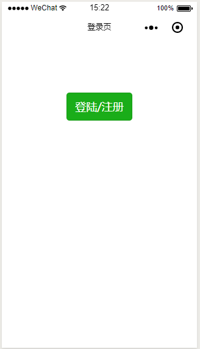
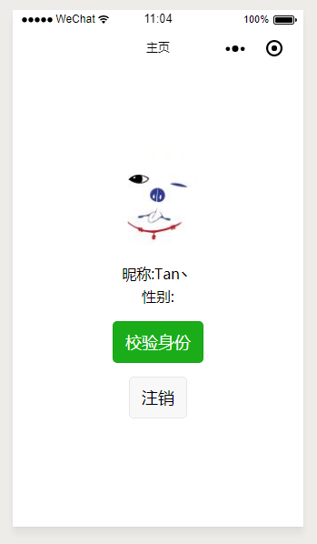

## 用户管理组件

小程序结合云能力实现用户登录注册管理 demo 实例

#### update

做了个[小工具](https://github.com/flytam/tcb-router)

#### 目录结构说明

```
|- client 小程序客户端代码
    |- components
        |- login 登录/注册自定义组件的相关逻辑
    |- pages
        |- index
        |- main 登录之后主页
    |- config
        |- 配置项
|- cloud 云端代码
    |- database 数据库
    |- functions 云函数代码
        |- loginRegister   处理登录注册注销
            |- lib      一些工具函数
                |- db.js  数据库初始化
                |- code2openid.js 使用微信客户但的code去换取openid和seesion_key
                |- create_session.js 生成自定义态的session
            |- index.js 云函数入口
            - controllers.js 控制器
            |- config
                |- index.js   配置项
                |- example.js 配置样例项
            |- package.json   依赖项
|- server 服务端代码
```

#### 配置相关

- 客户端配置

  参考 client/config/example.js，建立 config/index.js 文件写对应的 env

- 填入 project.config.json 中对应的 appid

- 数据库和云函数配置
  参考 cloud/functions 下/\*/config 目录下的 example.js，建立 index.js 文件写相关配置配置详见 example

#### 说明

本 demo 中，自定义登录态的有效时间是在 loginSteam 函数中的配置中的有效时间结合微信的 session_key 有效时间的，数据库存放当前的 session 最长有效时间（相应的可在 loginSteam 相应的 config.js 中进行配置）、客户端也在 onShow 中检测 session 是否有效。[文档参考](https://developers.weixin.qq.com/miniprogram/dev/api/api-login.html)

#### 使用

云端使用说明

1、云函数目录下（本例中是在 cloud/functions/\*下）

```bash
tnpm i --production
```

2、按照上面的配置说明进行相应配置，填入对应信息

```javascript
// 配置文件 以loginRegister函数为例
const config = {
  secret: "xxxx", // 小程序的secret
  wxid: "xxxxx", // 小程序appid
  envName: "xxxx", // TCB环境ID
  secretId: "xxxx", // 数据库的secretId
  secretKey: "xxxxxx", // 数据库的secretKey
  time: 1000 * 60, // 云端session有效时间1分钟 单位毫秒
  sessionSecret: "xxxx" // 用于生成自定义态session的密钥
};

module.exports = config;
```

3、用微信开发者工具打开本项目，开发者工具中选中对应的云函数目录，右键上传部署

客户端使用说明

按照上面的客户端配置好就行了

#### 效果图

 
